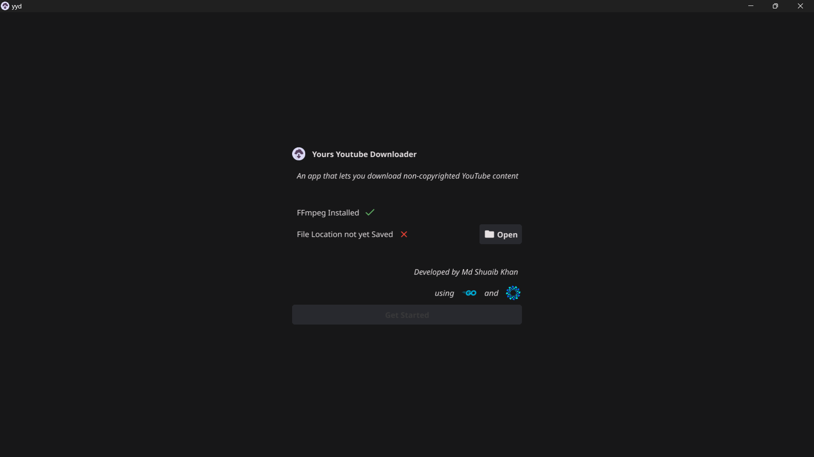
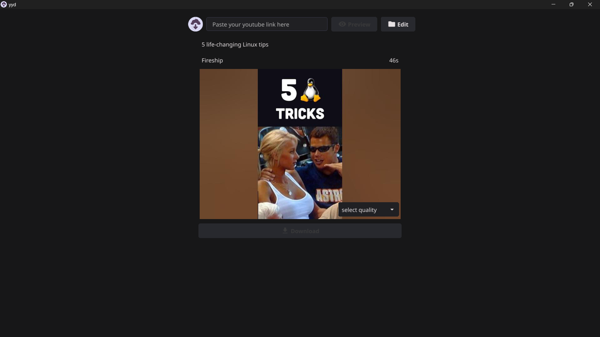
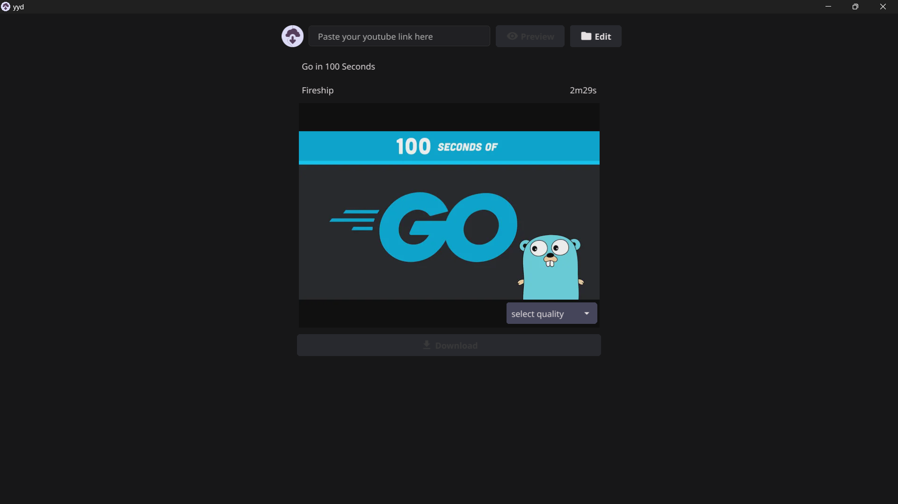
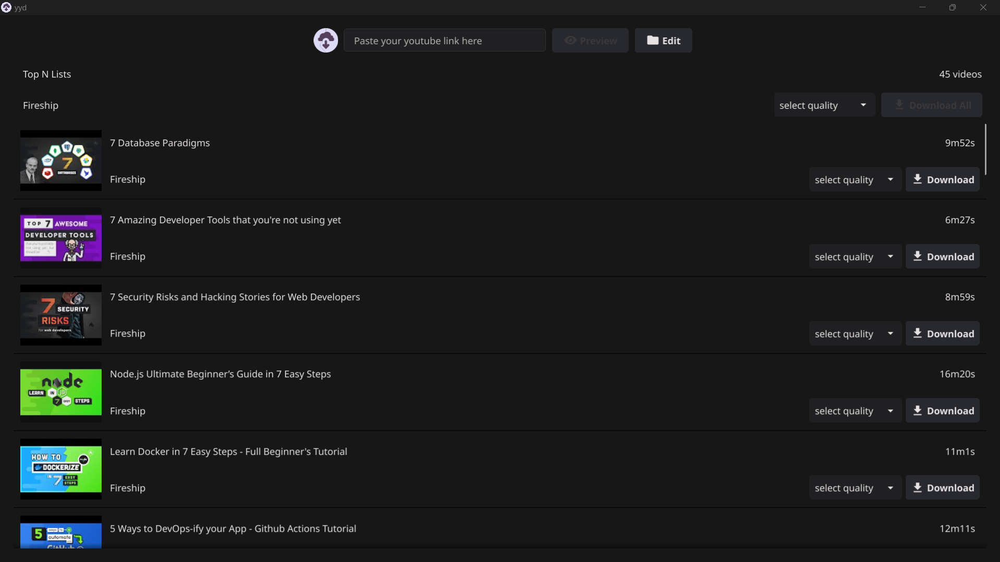

# Yours YouTube Downloader Desktop App

This is a simple desktop application built with Fyne and Go, allowing users to download YouTube videos, Shorts, or playlists in any available quality. The app requires `ffmpeg` as a dependency to handle video processing.

## Features

- **Download Options**: Supports downloading from YouTube videos, Shorts, and playlists.
- **Quality Selection**: Choose from available download qualities.
- **Flexible Output Location**: Select a folder to save downloads.

## Preview
Below are preview images of the application running on Windows 11. These previews are for testing purposes only.

| Get Started                                   | Shorts                                    |
| --------------------------------------------- | ----------------------------------------- |
|  |  |

| Video                                        | Playlist                                  |
| --------------------------------------------- | ----------------------------------------- |
|       |  |

*Tested on Windows 11.*

## Important Disclaimer
This application is intended **only for downloading non-copyrighted content** or content that you have the right to download. Please respect YouTube's terms of service and copyright laws.

## Prerequisites

1. **Go**: Install [Go](https://golang.org/dl/) (version 1.22 or higher is recommended).
2. **Fyne**: Install the Fyne toolkit by following their official [installation instructions](https://docs.fyne.io/started/).
3. **FFmpeg**: Install [FFmpeg](https://ffmpeg.org/download.html), as it is required for video processing.
